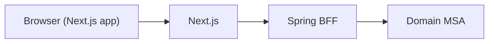
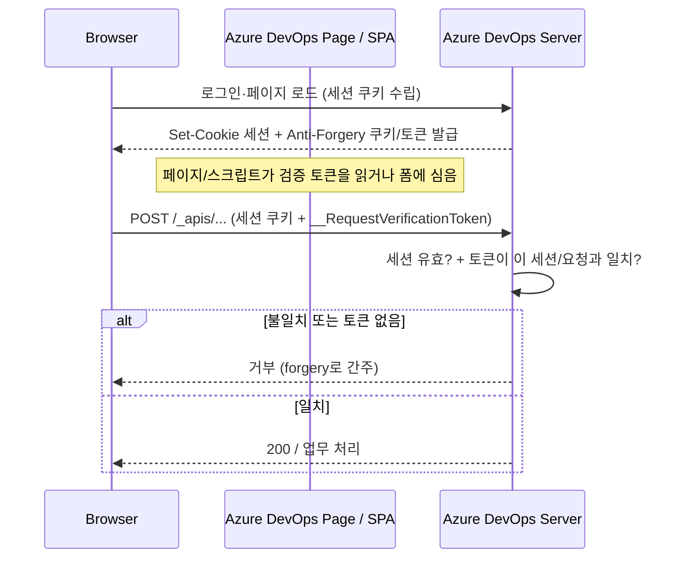
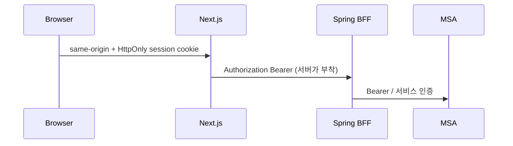

# SECURITY-NOTES.tmp.md

> **임시 문서** — 대화 중 보안 아키텍처 논점을 정리한 메모다.  
> 나중에 삭제하거나 `docs/` 등으로 옮길 수 있다. **공식 ISMS/보안 체크리스트가 아니다.**  
> 파일명에 `.tmp`를 넣어 “임시”임을 명확히 한다. **이 문서만 추가했으며, 코드 변경·커밋은 하지 않는다.**

---

## 1. 문서 목적

- 코드 변경·리팩터 전에 **논점·위협 모델·설계 옵션**을 한곳에 모아 두기 위함이다.
- 감사/ISMS 제출용 산출물이 아니라, **내부 ADR 초안 / 기술 블로그 톤**의 토론 메모다.
- “무엇을 당장 고칠지”와 “장기적으로 어떤 패턴이 우리 스택에 맞는지”를 구분해서 기록한다.

---

## 2. 전제 아키텍처 (우리)



| 계층 | 역할 (요약) |
|------|-------------|
| Next.js | UI, 라우팅, next-auth 세션, 일부 SSR/BFF성 서버 코드 |
| Spring BFF | 프론트 친화 API, 인증·인가 경계, MSA 집약 |
| Domain MSA | 도메인 서비스 (Bearer 등 서비스 간 인증) |

### 인증 흐름 (현재에 가까운 그림)

1. **next-auth**로 로그인·세션 관리
2. 세션에 **accessToken(JWT)** 포함
3. 클라이언트 **AuthProvider**가 세션에서 토큰을 읽어
4. **serviceContainer.setToken** 등으로 REST 클라이언트에 주입 → API 호출 시 `Authorization: Bearer …`

### `NEXT_PUBLIC_*` 시크릿 이슈 (요약)

- `NEXT_PUBLIC_` 접두사는 **클라이언트 번들에 노출**된다.
- OAuth client secret, 암호화 키 등을 `NEXT_PUBLIC_`에 두면 **시크릿이 아니다** — 누구나 DevTools/번들에서 볼 수 있다.
- 서버 전용 env(접두사 없음)와 public 설정을 분리해야 한다.

---

## 3. 핵심 논점

### 3.1 `NEXT_PUBLIC` = not secret

- 공개되어도 되는 값(공개 API base URL, OAuth **client id** 등)만 `NEXT_PUBLIC_`에 둔다.
- secret / private key / hashing pepper 는 **절대** `NEXT_PUBLIC_`에 두지 않는다.

### 3.2 클라이언트 측 암호화의 한계

- 브라우저에서 돌리는 “암호화”의 키도 결국 JS에 있거나, 서버에서 받은 키를 JS가 쓰게 되면 **공격자(XSS)와 동일 권한**을 갖는다.
- “비밀번호를 클라이언트가 암호화해서 보낸다”가 **서버 해시 + HTTPS**를 대체하지 않는다.
- 전송 구간 보호는 **TLS(HTTPS)** 가 담당하고, 저장 시 보호는 **서버 측 단방향 해시(및 salt/pepper)** 가 담당한다.

### 3.3 비밀번호 변경

- **HTTPS + 서버에서 해시/검증**이 정석이다.
- 클라이언트 crypto는 “보안의 본진”이 아니다.

### 3.4 XSS vs JS에 올라간 토큰

- XSS가 나면, JS가 읽을 수 있는 토큰은 탈취될 수 있다.
- 토큰을 localStorage에 두든, 메모리/React state에 두든, **XSS 페이로드가 같은 출처에서 실행되면** 접근 가능한 경우가 많다.
- 완화: CSP, 출력 이스케이프, 의존성/리치 에디터 관리, HttpOnly로 **브라우저 JS가 못 읽게** 하는 세션 쿠키 등.

### 3.5 next-auth와 쿠키 / accessToken 노출

- next-auth는 기본적으로 **세션 쿠키를 HttpOnly**로 쓰는 편이다 → “쿠키 자체 = localStorage에 토큰 저장”과는 다르다.
- 우리 논의의 핵심 문제는 “next-auth가 localStorage를 쓴다”가 아니라,  
  **세션 콜백/클라이언트 세션으로 `accessToken`을 JS에 내려보내는 설계**다.
- 즉: **HttpOnly 세션 쿠키는 있어도, accessToken을 session으로 hydrate하면 토큰이 JS에 노출**된다.

### 3.6 Bearer는 여전히 Spring Security의 표준

- API에 `Authorization: Bearer <JWT>` 는 흔한 패턴이다.
- 질문의 본질은 Bearer를 쓰느냐가 아니라 **누가 붙이느냐**다.
  - **브라우저 JS**가 붙인다 → XSS 시 토큰 탈취 면적 ↑
  - **Next 서버 / Gateway / BFF**가 붙인다 → 브라우저에는 짧은 세션 쿠키만, Bearer는 서버 사이드

### 3.7 Cookie도 완벽하지 않다

| 위협 | Cookie (HttpOnly 세션) | JS에 든 Bearer |
|------|------------------------|----------------|
| XSS로 토큰 문자열 탈취 | 어렵거나 불가능(HttpOnly) | 쉬움 |
| XSS로 “사용자로서” 요청 | 가능 (쿠키 자동 전송) | 가능 |
| CSRF | SameSite/토큰 등 필요 | Bearer는 CSRF 덜 전형적(헤더는 자동 안 붙음) |
| 도메인/CORS | first-party·same-site 설계 중요 | CORS + Bearer도 별도 이슈 |

- Cookie는 **다른 위협 모델**이다. “쿠키 = 무조건 안전”이 아니라 **토큰 탈취 vs 세션 악용**의 트레이드오프다.

### 3.8 쿠키 악용에 대한 글로벌 관행 대응

HttpOnly 쿠키로 **JS가 세션 문자열을 읽는 것**은 막혀도, 아래는 남는다.

| 남는 공격 | 요지 |
|-----------|------|
| **CSRF** | 다른 사이트가 피해자 브라우저를 시켜, 쿠키가 자동 첨부된 상태 변경 요청을 보냄 |
| **XSS → “사용자로서” 요청** | 스크립트가 쿠키를 못 읽어도, 같은 출처에서 `fetch`하면 쿠키가 따라감 |
| **세션 탈취·도용** | 물리 접근, 악성 확장, 중간자(비HTTPS), 장기 세션 재사용 |
| **쿠키 설정 실수** | `Secure`/`Domain`/`SameSite` 잘못 → 과도한 전송·고착 |

글로벌 웹 서비스는 쿠키를 “믿기”보다 **아래를 겹쳐** 잔여 리스크 비용을 올린다.

#### (1) 쿠키 속성 자체

| 속성 / 관행 | 역할 |
|-------------|------|
| **HttpOnly** | `document.cookie`로 세션 쿠키 읽기 차단 (XSS→토큰 문자열 유출 완화) |
| **Secure** | HTTPS에서만 전송 |
| **SameSite=Lax / Strict** | 크로스 사이트 네비·요청에 쿠키가 덜 붙게 해 **기본 CSRF 면적 축소** (`None`은 `Secure` 필수, 임베드/크로스 사이트용) |
| **`__Host-` / `__Secure-` prefix** | 브라우저가 강제하는 규칙 (예: `__Host-`는 `Secure` + `Path=/` + Domain 지정 금지). Google의 `__Secure-1PSID` 등이 이 계열 |
| **짧은 TTL + 회전(rotation)** | 탈취·재사용 가능 시간 제한; 로그인·권한 상승 시 세션 ID 재발급(세션 고정 완화) |
| **first-party / same-site 범위** | UI와 API 엣지를 같은 사이트에 두어 크로스 사이트 쿠키·CORS 고통을 줄임 |

#### (2) CSRF 전용 방어 (SameSite만으로 부족할 때)

SameSite는 브라우저·레거시·일부 크로스 사이트 시나리오에서 구멍이 남을 수 있어, **상태 변경 API**에는 추가 검증이 흔하다.

| 기법 | 요지 |
|------|------|
| **Synchronizer / Request Verification Token** | 서버가 예측 불가 토큰을 발급 → 폼 hidden 또는 헤더/바디로 다시 보냄. 쿠키만으로는 요청이 성립하지 않음. **Azure DevOps의 `__RequestVerificationToken`이 전형** (아래 상세) |
| **Double-submit cookie** | 쿠키에 CSRF 값 + 같은 값을 헤더에 요구 (커스텀 헤더는 크로스 사이트에서 자동으로 안 붙음) |
| **Origin / Referer 검사** | 상태 변경 요청의 출처가 허용 목록인지 서버가 확인 |
| **POST 등에만 민감 처리** | 단순 GET으로 상태 변경하지 않기 |

#### (3) XSS 잔여 (“쿠키 달린 요청을 대신 보내기”)

- **CSP** (nonce / `strict-dynamic` 등) — Google Search 응답에서 관측된 것처럼 스크립트 실행 면적 축소
- 출력 이스케이프, `dangerouslySetInnerHTML` 최소화, 의존성·공급망 관리
- 민감 동작(비밀번호·결제·권한)은 **step-up MFA / 최근 재인증** — “세션 쿠키만 있으면 무조건 통과”를 피함

#### (4) 세션 도용·이상 탐지

- IP / 디바이스 / UA 급변 시 재로그인
- 동시 세션 수 제한, 로그아웃·비밀번호 변경 시 **서버 측 세션 무효화**
- 감사 로그·레이트 리밋 (브루트포스·세션 남용)

#### (5) 한 줄로 보는 방어 스택

```text
HttpOnly + Secure + SameSite (+ __Host-/__Secure-)
  + CSRF token 또는 Origin 검증 (상태 변경)
  + CSP / XSS 완화
  + 짧은 세션·회전·step-up MFA
  + (규모에 따라) 이상 탐지
```

쿠키 모델의 목표는 “악용 0”이 아니라, **토큰 문자열 원격 재사용**을 막고, **브라우저를 빌린 공격**은 CSRF·CSP·MFA로 비용을 올리는 것이다.

---

### 3.8.1 Azure `__RequestVerificationToken` 패턴 (자세히)

Azure DevOps Network 캡처에서 쿠키(및 관련 필드)로 보이던:

- `__RequestVerificationToken=...`
- `__RequestVerificationToken{guid}=...` 형태(이름에 세션/컨텍스트별 suffix)

는 ASP.NET 계열에서 오래 쓰인 **Anti-Forgery / Request Verification Token**(CSRF 방어) 패턴이다. “세션 쿠키만 있으면 POST 성공”을 막기 위한 장치다.

#### 왜 필요한가 (CSRF 한 줄)

1. 사용자가 `dev.azure.com`에 **이미 로그인** → 브라우저가 해당 사이트 쿠키를 보관  
2. 악성 사이트 `evil.example`가 숨은 폼/`fetch`로 `dev.azure.com`에 **상태 변경 POST**를 유도  
3. 브라우저가 **same-site 규칙·쿠키 정책에 따라** 피해자 쿠키를 붙여 보낼 수 있는 경우, 서버가 **쿠키만** 보면 “정상 사용자”로 착각  
4. 그래서 서버는 **“이 요청을 우리 페이지/우리 JS가 의도적으로 만들었는가?”** 를 추가로 묻는다 → **요청 검증 토큰**

Bearer만 쓰는 API는 커스텀 `Authorization` 헤더가 크로스 사이트에서 자동으로 안 붙는 편이라 CSRF 면적이 다르고, **쿠키 세션 웹**에서는 이 토큰이 전형적이다.

#### 동작 흐름 (개념)



1. **발급:** 서버가 추측하기 어려운 랜덤 토큰을 만든다. 보통  
   - 쿠키에 한 벌(`__RequestVerificationToken` …),  
   - 그리고 **요청 본문·커스텀 헤더·폼 필드**에 같은(또는 쌍을 이루는) 값을 요구한다.  
2. **정당한 UI만 토큰을 안다:** 같은 출처에서 로드된 HTML/JS만 토큰을 읽어 API에 실을 수 있다. (HttpOnly가 **아닌** CSRF 쿠키인 경우가 많아, JS가 읽어 헤더/바디에 복사하는 **double-submit**에 가깝게 동작하기도 한다.)  
3. **검증:** 서버는 “쿠키의 값 ↔ 헤더/바디의 값” 일치, 또는 서버에 저장한 세션 바인딩 토큰과 일치를 본다.  
4. **악성 사이트는:** 피해자 세션 쿠키는 자동 첨부될 수 있어도, **우리 페이지가 넣어 주는 검증 토큰**을 읽지 못하면(동일 출처 정책) 유효한 조합을 만들기 어렵다.

캡처에 이름이 두 개처럼 보이던 것(`__RequestVerificationToken` + suffix 붙은 이름)은 **앱/세션 단위로 쿠키 이름을 나누거나**, 레거시와 신규 파이프라인을 같이 쓰는 흔적일 수 있다. 본질은 같다: **CSRF용 anti-forgery 값**.

#### Azure 캡처와의 관계 (해석)

- DevOps는 **Bearer(MSAL)** 와 **쿠키**를 같이 쓰는 편이다.  
- Bearer가 있는 XHR이라도, 플랫폼/레거시 파이프라인·쿠키 기반 호스트 인증 때문에 **anti-forgery 쿠키가 같이 실리는** 모습을 볼 수 있다.  
- `x-requested-with: Vss-Fetch` 같은 커스텀 헤더도, “단순 크로스 사이트 폼 POST”와 구분하는 **보조 신호**로 쓰이곤 한다(단독 만능은 아님).  
- 즉 Azure 예시는 “쿠키만 쓴다”가 아니라, **쿠키 세션 세계에서는 Request Verification Token이 표준 방어 키트에 들어간다**는 실측 사례로 읽으면 된다.

#### 우리 스택에 옮기면

| 상황 | 시사점 |
|------|--------|
| Next/Spring을 **쿠키 세션**으로 브라우저와 붙일 때 | SameSite만 믿지 말고, 상태 변경에 **CSRF 토큰 또는 Origin 검사**를 설계에 넣기 |
| Next가 same-origin BFF이고 뒤는 Bearer만 | 브라우저→Next 구간의 CSRF를 Next에서 막고, Next→Spring은 Bearer(서버 부착) |
| 지금처럼 클라 Bearer | CSRF면적은 상대적으로 작지만, **XSS→토큰 탈취**가 더 큰 논점 (본 문서 앞절) |

ASP.NET 용어로 검색할 때: *Anti-Forgery Token*, *ValidateAntiForgeryToken*, *RequestVerificationToken* — Azure에 보이던 이름이 이 계열이다.

---

## 4. 설계 옵션

### 옵션 A — Client가 accessToken 보유 (현재에 가까움)

- **장점:** 구현·디버깅 단순, Spring에 Bearer 그대로
- **단점:** XSS 시 토큰 도난, `NEXT_PUBLIC`/클라이언트 시크릿과 겹치면 피해 증폭

### 옵션 B — HttpOnly 쿠키를 Spring BFF에 직접

- 브라우저 → Spring BFF에 세션 쿠키
- **주의:** CSRF, 쿠키 Domain/Path/SameSite, HTTPS, 프론트와 API 호스트 관계

### 옵션 C — Hybrid (우리 스택과 잘 맞음)



- Browser ↔ Next(또는 first-party edge): **쿠키/짧은 세션**
- Next/Gateway ↔ Spring BFF ↔ MSA: **Bearer**
- “이중 BFF”를 억지로 늘리기보다, **브라우저 경계만 쿠키로 좁히고** 뒤는 기존 Bearer 유지

### 옵션 D — BFF 앞 Auth Gateway (대기업에서 흔함)

- Edge/Gateway에서 세션·토큰 교환, 내부는 mTLS/서비스 JWT 등
- 포트폴리오 규모에는 과할 수 있으나, **프로덕션 MSA**에서는 일반적

### CORS / cross-site 쿠키

- 다른 사이트·다른 등록 가능 도메인에 쿠키를 걸면 **SameSite·파티션·CORS**로 고통이 크다.
- **same-origin / first-party** (같은 사이트에서 UI와 API 엣지)를 선호하는 이유가 여기에 있다.

---

## 5. 대기업/글로벌 “실용 최선” 요약

실무에서 자주 보이는 “타협점”:

| 경계 | 실용 패턴 |
|------|-----------|
| 브라우저 엣지 | First-party / same-origin |
| 브라우저 ↔ 엣지 | HttpOnly 쿠키 **또는** 수명 짧은 메모리 토큰 |
| 엣지/BFF/Gateway ↔ MSA | Bearer (또는 내부 서비스 인증) |
| 모바일 네이티브 | OAuth/OIDC + Bearer를 **별도 채널**로 (웹 쿠키 모델과 분리) |

한 줄: **브라우저에는 세션을 좁게, 토큰 문자열은 JS 밖으로; 뒤쪽 MSA는 Bearer 유지.**

---

## 6. Azure DevOps 사례 (자세히)

> 사용자 Network 캡처 분석 기반. **실제 토큰·쿠키 값은 이 문서에 붙여 넣지 않는다.**  
> 채팅에 **라이브 토큰/쿠키가 노출**되었을 수 있으므로, 해당 자격 증명은 **폐기·재발급(로테이션)** 을 권장한다. (문서에는 redacted로만 취급)

### 관측

| 항목 | 내용 |
|------|------|
| URL 예 | `https://dev.azure.com/{org}/.../_apis/wit/workItemsBatch` |
| UI | React SPA 느낌 |
| Origin | **same-origin** — `dev.azure.com` 페이지 → `dev.azure.com/_apis` |
| Next BFF 홉 | 브라우저 Network에서 **별도 Next BFF 홉은 보이지 않음** |
| Authorization | `Authorization: Bearer …` |
| 클라이언트 힌트 | `x-vss-clientauthprovider: MsalTokenProvider` → **MSAL / Azure AD JWT를 브라우저가 붙이는** 패턴 |
| 쿠키 | `UserAuthentication`, `AadAuthentication` 등 **쿠키도 함께** 존재 |

### 패턴 해석

- **same-origin SPA + 클라이언트가 Bearer 부착 (+ 쿠키 병행)**
- “대기업은 Bearer를 브라우저에 안 쓴다”는 단순화는 **틀릴 수 있다**.  
  first-party 앱에서는 **브라우저 Bearer + 도메인 통합**이 여전히 쓰인다.
- 도메인을 하나로 묶으면 **cross-site 쿠키/CORS 지옥**을 피하면서, SPA가 `/_apis`에 직접 XHR 하는 모델이 성립한다.

### 우리 논의와의 함의

- Azure DevOps는 “Bearer 금지”가 아니라 **first-party + (필요 시) MSAL 토큰 in browser**.
- 우리 옵션 C(하이브리드)와 **다르지만**, “도메인 통일 + 엣지 설계”라는 축은 공유한다.
- XSS 위협 모델은 Azure에도 동일하게 적용된다 — 규모·CSP·제품 성숙도로 **잔여 리스크를 관리**하는 쪽에 가깝다.

---

## 7. Google Search 사례 (자세히)

> 역시 **실제 쿠키 값을 붙여 넣지 않는다.** 노출 시 세션 무효화·재로그인 등 조치 검토.

### 관측

| 항목 | 내용 |
|------|------|
| 요청 | `GET www.google.com/search?...` |
| 성격 | **문서 네비게이션** (HTML) — `content-type: text/html`, `sec-fetch-mode: navigate` |
| Authorization | **Bearer 없음** |
| 인증 | 쿠키 중심 (`SID`, `__Secure-1PSID` HttpOnly 등) |
| 보안 헤더 | CSP nonce, HSTS, X-Frame-Options, COOP 등 **강하게** 설정 |
| Origin | same-origin / first-party |

### 패턴 해석

- Azure DevOps의 **React SPA → `/_apis` JSON XHR** 과 **동일하지 않다**.
- Search는 **서버 렌더(gws)에 가까운 문서 응답**에 가깝고, “클라이언트가 Bearer를 API에 붙이는” 모델이 아니다.
- XSS로 **토큰 문자열을 훔치는** 관점에서는 **cookie-centric first-party** 모델에 더 가깝다.  
  (단, XSS로 세션 쿠키를 이용한 **행위 위조**는 별개로 남는다.)

---

## 8. Azure vs Google 비교 표

| 차원 | Azure DevOps (`/_apis`) | Google Search |
|------|-------------------------|---------------|
| 요청 유형 | XHR/fetch JSON API | Document navigate → HTML |
| UI 모델 | React SPA 체감 | 서버 주도 검색 결과(gws) |
| Bearer | **있음** (MSAL/AAD JWT) | **없음** |
| 쿠키 | 있음 (병행) | **주 인증 수단** |
| same-origin | 예 (`dev.azure.com`) | 예 (`www.google.com`) |
| 브라우저에 보이는 BFF | 별도 Next 홉 없음 | N/A (문서 서버) |
| XSS→토큰 문자열 탈취 | Bearer가 JS/MSAL에 있으면 면적 있음 | HttpOnly 중심이면 문자열 탈취는 상대적으로 어려움 |
| 우리 옵션과의 거리 | “Client Bearer + first-party” (옵션 A 계열) | “Cookie-centric edge” (옵션 B/C의 브라우저 쪽) |

**공통점:** 둘 다 **first-party / same-origin** 을 전제로 인증을 단순화한다.  
**차이점:** SPA+API는 Bearer를 브라우저에 두는 경우가 있고, 문서형 서비스는 쿠키·서버 세션에 기대는 경우가 많다.

---

## 9. Firebase SSO 과거 경험과의 관계

- Client ↔ Firebase 로그인은 **공식 SDK 경로**다.
- 백엔드는 **ID 토큰 검증**이 필수다 (토큰만 믿고 통과 금지).
- ID 토큰을 JS에 들고 API에 붙이면, **XSS 위협 등급은 accessToken-in-JS와 같은 계열**이다.
- “Firebase라서 예외”가 아니라, **동일 위협 모델 + 제품이 제공하는 검증·만료·갱신 규약**을 따르는 것이다.

---

## 10. 이 레포(포트폴리오) Critical 갭 요약

이전 리뷰 기준 **짧은** 목록 (완전 감사 목록 아님):

- `NEXT_PUBLIC_*` 에 OAuth secret / crypto key 류가 노출될 수 있는 구성
- `session.accessToken` 을 클라이언트로 내려 JS가 Bearer 부착
- 보안 헤더(CSP, HSTS, frame 보호 등) 미흡 또는 부재 가능
- (기타) 시크릿·환경 분리, 쿠키 SameSite, CSRF(쿠키 전환 시) 등 후속 검토 필요

**포트폴리오 vs 프로덕션 ISMS**

- 포트폴리오는 학습·쇼케이스 목적이라도 **공개 시크릿은 Critical**에 가깝다.
- ISMS/대기업 기준의 “전 항목 충족”을 이 레포에 그대로 요구하진 않더라도,  
  **공개 repo / 공개 배포면 시크릿·토큰 노출은 우선 제거**하는 편이 맞다.

---

## 11. 권장 방향 (우리 스택: Next → Spring BFF → MSA)

### Prefer

1. 브라우저는 **Next(또는 first-party BFF 엣지)와 same-origin**, **HttpOnly 세션**
2. **Next / Gateway가** Spring BFF 호출 시 **Bearer 부착**
3. MSA는 기존처럼 **Bearer(또는 내부 인증)** 유지
4. 불필요한 **이중 BFF** 를 만들지 말 것 — 브라우저 경계만 정리

### Phase (현실적 순서)

| 단계 | 내용 |
|------|------|
| 1 | `NEXT_PUBLIC` 시크릿 제거·로테이션 (당장) |
| 2 | 클라이언트 `accessToken` 노출 축소 (세션에서 JS로 안 내리기 / 서버 프록시) |
| 3 | Hybrid로 점진 이전 — **전면 재작성보다** 경계부터 |

### Open questions / TBD

- 세션을 Next에 둘지, Spring에 둘지 (단일 세션 소스)
- refresh token 보관 위치·로테이션
- CSRF 전략 — 상세는 **§3.8 / §3.8.1** (SameSite + Request Verification Token / Origin 검증 등). 우리 스택에서 “브라우저↔Next”에 무엇을 적용할지 결정만 남음
- 모바일/외부 클라이언트가 붙을 때 OAuth 분리 여부
- 포트폴리오 범위에서 “어디까지 구현할지” vs 프로덕션 백엔드 표준

---

## 12. 용어

| 용어 | 짧은 정의 |
|------|-----------|
| **BFF** | Backend for Frontend — UI에 맞춘 API/집약 계층 |
| **same-origin** | scheme + host + port 가 같음 → 쿠키·CORS가 단순해짐 |
| **Bearer** | `Authorization: Bearer <token>` — 토큰을 헤더로 제시 |
| **HttpOnly** | JS(`document.cookie`)로 쿠키를 읽지 못하게 하는 플래그 |
| **XSS** | Cross-Site Scripting — 악성 스크립트가 피해자 출처에서 실행 |
| **CSRF** | Cross-Site Request Forgery — 로그인 상태의 원치 않는 요청 유발 |
| **Anti-Forgery / Request Verification Token** | CSRF 방어용 예측 불가 토큰. 쿠키만으로 요청이 성립하지 않게 함. Azure의 `__RequestVerificationToken` 등 (**§3.8.1**) |
| **SameSite** | 쿠키를 크로스 사이트 요청에 얼마나 붙일지 브라우저에 지시 (`Strict` / `Lax` / `None`) |
| **step-up MFA** | 민감 동작 직전에 추가 인증을 요구해 세션 쿠키만으로의 피해를 제한 |
| **MSA** | Microservice Architecture — 도메인별 서비스 분리 |

---

## 메타

- **경로:** `SECURITY-NOTES.tmp.md` (repo root)
- **상태:** 임시 · 비커밋 전제 · 코드 변경 없음
- **다음 가능 액션:** ADR로 승격, Critical 이슈 티켓화, 또는 삭제
