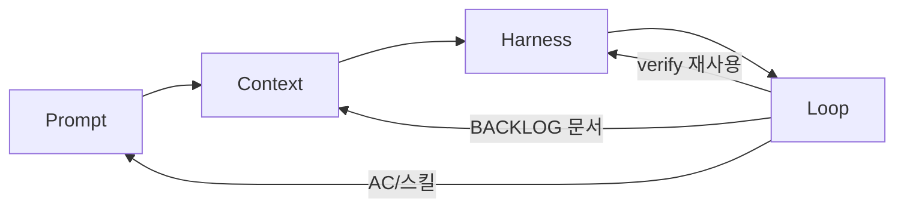

# 루프엔지니어링 설계

> **목적:** 이 모노레포에서 에이전트 작업을 **프롬프트 → 컨텍스트 → 하네스 → 루프** 네 층으로 나눠, 설계 의도·현재 상태·다음에 넣을 것을 한곳에 누적한다.  
> **스코프:** 모노레포 공통 레일 + **앱별** `verify:<app>` (1호 `@apps/user-portfolio`). 전 앱 일괄 게이트 금지.  
> **역할:** Cursor = Build · Claude = Pre-PR review · 사람 = PR APPROVE/merge.  
> **충돌 시:** 앱/아키텍처 규칙은 [`README.md`](../../README.md) · 에이전트 요약은 [`AGENTS.md`](../../AGENTS.md).  
> **관련:** [`docs/harness/`](../harness/README.md) · [`LOOP.md`](./LOOP.md) · [`GITHUB-ACTIONS.md`](./GITHUB-ACTIONS.md) · [`RUNNERS.md`](./RUNNERS.md)

**이 파일은 living doc이다.** 층별로 추가·변경되면 해당 절과 아래 현황 표를 함께 고친다.

---

## 한 줄 정의

| 층 | 한 줄 |
|----|--------|
| **프롬프트 엔지니어링** | 에이전트에게 보내는 문장·지시 형식을 잘 쓰는 기술 |
| **컨텍스트 엔지니어링** | 에이전트가 참고할 정보(문서, 코드, 규칙)를 잘 골라 주는 기술 |
| **하네스 엔지니어링** | 에이전트가 일할 환경(도구, 권한, 실행·검증 조건)을 잘 갖추는 기술 |
| **루프 엔지니어링** | 위 층이 사람 없이 반복되도록 **주기·종료조건·메모리·안전레일**을 설계하는 기술 |

```text
사람/스케줄러
    │
    ▼
[프롬프트] 목표·제약을 짧게
    │
    ▼
[컨텍스트] AGENTS / README / 스킬 / 관련 코드
    │
    ▼
[하네스] 도구 + verify/guard + denylist + CI
    │
    ▼
[루프] BACKLOG → Cursor Build → Claude pre-PR review → 사람 PR APPROVE/merge
```

**현재 포지션:** 하네스·루프는 **모노레포 공통 문서/스크립트** + portfolio 1호 게이트. 기본 `loop: paused`. Claude는 머지 승인자 아님(Pre-PR만).

---

## 현황 요약 (업데이트 시 여기부터)

| 층 | 성숙도 | 상태 (한 줄) |
|----|--------|----------------|
| 프롬프트 | 관행+템플릿 | AC + [`AI-TASK-PROMPT.md`](./AI-TASK-PROMPT.md) · loop-plan/build |
| 컨텍스트 | 강함 | AGENTS / README / FSD / skills / `docs/harness`+`docs/loop` |
| 하네스 | H1~H6 (모노레포, 앱 게이트 1호 full) | SoT: [`docs/harness/README.md`](../harness/README.md) |
| 루프 | L2~L5 | 정책 SoT: [`LOOP.md`](./LOOP.md) · Actions: [`GITHUB-ACTIONS.md`](./GITHUB-ACTIONS.md) |

마지막 갱신: 2026-09 (문서 슬림화 — 운영 표는 harness/LOOP로 이관, 이 파일은 4층 living)

---

## 1. 프롬프트 엔지니어링

### 1.1 의도

에이전트에게 **무엇을 할지 / 무엇을 하지 말지 / 무엇으로 끝났다고 할지**를 짧게·체크 가능하게 전달한다.  
프롬프트만으로 품질을 끌어올리기보다, 아래 컨텍스트·하네스가 받쳐 주도록 한다.

### 1.2 현재 이 프로젝트에서의 형태

| 자산 | 역할 |
|------|------|
| 이슈·채팅 지시 | 작업 단위 목표 (사람이 작성) |
| [`.cursor/skills/plan-change`](../../.cursor/skills/plan-change/SKILL.md) | AC에 Unit·E2E·`verify:portfolio` 유도 |
| [`.cursor/skills/loop-plan`](../../.cursor/skills/loop-plan/SKILL.md) | BACKLOG 한 항목 AC 작성 |
| [`.cursor/skills/loop-build`](../../.cursor/skills/loop-build/SKILL.md) | 한 백로그 = 한 Build 계약 |
| [`.cursor/skills/verify`](../../.cursor/skills/verify/SKILL.md) | “끝나면 verify 돌려라” 절차 프롬프트 |
| [`.cursor/skills/safe-edit`](../../.cursor/skills/safe-edit/SKILL.md) | denylist·시크릿 건드리지 말라는 제약 프롬프트 |
| 커밋/브랜치 규칙 ([`AGENTS.md`](../../AGENTS.md)) | 형식 제약 — 훅이 강제 |

### 1.3 잘된 점

- “검증 통과”를 말보다 **명령**으로 말하게 스킬화함
- human gate(보안 경로)를 프롬프트 스킬로 명시

### 1.4 부족 / 다음에 넣을 것

- [x] 작업 유형별 프롬프트 템플릿 (feat / refactor / docs / hotfix) — [`AI-TASK-PROMPT.md`](./AI-TASK-PROMPT.md)
- [x] 루프 Build용 “한 백로그 = 한 프롬프트” 계약 (`loop-build` / `docs/loop/BACKLOG.md`)
- [x] 한국어 응답·커밋 컨벤션을 AGENTS에 두고 이슈는 최소 지시 — [`AI-TASK-PROMPT.md`](./AI-TASK-PROMPT.md)

---

## 2. 컨텍스트 엔지니어링

### 2.1 의도

에이전트가 매 턴 추측하지 않도록, **읽을 문서·레이어 경계·명령**을 레포 안에 고정한다.  
Cursor / Claude Code가 파일을 잘 집어 오더라도, **무엇을 소스 오브 트루스로 둘지**는 프로젝트가 정한다.

### 2.2 현재 구조

| 우선순위 | 경로 | 내용 |
|----------|------|------|
| 1 | [`README.md`](../../README.md) | FSD·폴더명·REST·i18n 등 상세 SoT |
| 2 | [`AGENTS.md`](../../AGENTS.md) | 에이전트용 요약 + Commands + harness 포인터 |
| 3 | [`docs/harness/`](../harness/) | verify / denylist / H1~H6 |
| 4 | [`docs/loop/`](./) | BACKLOG / STATE / LOOP / Actions / runners |
| 5 | [`.cursor/skills/`](../../.cursor/skills/) | verify · plan-change · safe-edit · loop-* |
| 6 | `node_modules/@shin96bc/ai-skills/...` | 웹 디자인 / CBD·FSD 퍼블 / Jest 등 작업 스킬 |
| 7 | [`SECURITY-NOTES.tmp.md`](../../SECURITY-NOTES.tmp.md) | 보안 논점 (코드 반영은 BACKLOG B-002) |

코드 컨텍스트(자동):

- FSD 레이어: `apps/*/src/fsd/{app,pages,widgets,features,entities,shared}`
- 도메인 패턴: `entities/*/api` + `model` + mapper (wire→client)
- Mock: MSW handlers (`shared/config/mock`)

### 2.3 잘된 점

- README ↔ AGENTS 이중 구조로 **요약 vs 상세** 분리
- Biome / `lint:fsd`가 “문서만의 규칙”이 아니라 **기계가 읽는 컨텍스트**로도 동작
- 하네스·루프 문서를 분리해 컨텍스트 과부하를 줄임

### 2.4 부족 / 다음에 넣을 것

- [x] 루프 도입 시 `docs/loop/` 와 이 문서의 역할 표 고정
- [ ] SECURITY-NOTES → `docs/` 정식화 후 AGENTS에서 링크 — [`ROADMAP.md`](./ROADMAP.md)
- [x] 모노레포 공통 vs 앱별 `verify:<app>` 표 (`docs/harness`)
- [x] 타 앱 `verify:<short>` lite 게이트 (`app-gates.mjs`)

---

## 3. 하네스 엔지니어링

### 3.1 의도

에이전트(와 사람)가 **같은 합격 신호**로 “됐다/안 됐다”를 말하게 한다.  
도구·훅·CI·가드·스킬이 그 환경이다.

### 3.2 운영 SoT (여기에 표 복제하지 않음)

상세·앱 게이트 표·H1~H6·조각 위치·로컬 팁:

→ **[`docs/harness/README.md`](../harness/README.md)** · denylist: [`DENYLIST.md`](../harness/DENYLIST.md) · 테스트 강제: [`TESTING.md`](../harness/TESTING.md)

### 3.3 잘된 점 (설계 메모)

- 로컬·PR·deploy quality가 **한 명령**으로 수렴
- UI 앱에 맞게 smoke e2e + MSW
- 보안 민감 경로는 **수정 금지(가드)** 와 **코드 리라이트(SECURITY BACKLOG)** 를 분리

### 3.4 다음에 넣을 것

체크리스트는 [`ROADMAP.md`](./ROADMAP.md) (snap CI, strict denylist, Jest 확대, lite→full, B-002 allowlist 등).

---

## 4. 루프 엔지니어링

### 4.1 의도

사람이 매번 “확인해 / 고쳐 / 다시”를 치지 않아도, 에이전트가 **체크 가능한 목표**까지 verify·수정을 반복하고, 위험하면 멈추게 한다.  
하네스의 `verify`를 **종료 조건**으로 쓰고, 메모리·예산·독립 verifier·worktree를 얹는다.

정책·limits·역할: [`LOOP.md`](./LOOP.md)  
자동화: [`GITHUB-ACTIONS.md`](./GITHUB-ACTIONS.md) · [`RUNNERS.md`](./RUNNERS.md) · [`ACTIONS-SETUP.md`](./ACTIONS-SETUP.md)

### 4.2 목표 흐름

```text
사람: BACKLOG 또는 AI Task 이슈에 AC 작성
        │
        ▼
Report (선택): 관측 → STATE (코드 변경 금지)
        │
        ▼
Cursor Build: lock → 구현 → verify:<app>
        │
        ▼
Claude Pre-PR (loop-verify): PASS_TO_HUMAN | REJECT
        │  (PASS만)
        ▼
사람: PR APPROVE / merge → BACKLOG-DONE

Emergency: STATE.md 에 loop: paused
```

### 4.3 현재 레일 (요약)

| 레일 | 상태 | SoT |
|------|------|-----|
| `verify:<app>` / guard | ✅ | [`docs/harness/README.md`](../harness/README.md) |
| BACKLOG / STATE / run-log / limits | ✅ | 이 폴더 · [`LOOP.md`](./LOOP.md) |
| Cursor Build / Claude Pre-PR / 사람 merge | ✅ | [`LOOP.md`](./LOOP.md) |
| budget / lock / kill switch | ✅ | `scripts/loop-*` · STATE |
| worktree | ✅ | [`WORKTREE.md`](./WORKTREE.md) |
| Actions cloud/local | ✅ | [`RUNNERS.md`](./RUNNERS.md) |
| snap UI vision | △ 최소 · 비게이트 | [`ROADMAP.md`](./ROADMAP.md) |

### 4.4 다음에 넣을 것

→ [`ROADMAP.md`](./ROADMAP.md)

### 4.5 하지 말 것

- AC 없는 Build
- Cursor가 자기 Pre-PR 통과 선언 후 사람 없이 merge
- Claude가 PR APPROVE/merge
- denylist·paused 없이 무제한 루프
- 사용자 요청 없이 commit / push / force push
- 모노레포 전 앱을 한 verify에 묶기

---
## 5. 레이어 간 의존



- **루프는 하네스 없이 성립하지 않음** → 이미 H3~H6까지 깔아 둔 이유.
- **컨텍스트가 약하면** 루프가 잘못된 파일을 고친다 → AGENTS/FSD 유지가 루프 품질의 전제.
- **프롬프트**는 루프 시대에도 “백로그 한 줄”로 남는다. 길어질수록 컨텍스트·하네스로 내린다.

---

## 6. 파일 맵

인덱스: [`README.md`](./README.md) (이 폴더 TOC).

```text
docs/loop/DESIGN.md          ← 4층 living (의도·의존·changelog)
docs/loop/LOOP.md            ← 루프 정책 SoT
docs/harness/                ← verify·DENYLIST·TESTING 운영 SoT
docs/loop/AI-TASK-PROMPT.md  ← 이슈 프롬프트 SoT
AGENTS.md · README.md        ← 에이전트 요약 · 아키텍처 SoT
scripts/* · .cursor/skills/* · .github/workflows/*
SECURITY-NOTES.tmp.md        ← 보안 논점 (임시 → ROADMAP)
```

---

## 7. 변경 로그

| 날짜 | 요약 |
|------|------|
| 2026-09 | 초안. 4층 정의 + 현 상태(하네스 H1~H6, 루프 미구축) 정리 |
| 2026-09 | 루프 L2+ : `docs/loop`, skills, lock/budget, Actions AI loop |
| 2026-09 | 모노레포 톤 + Cursor Build / Claude Pre-PR / 사람 PR APPROVE |
| 2026-09 | app-gates full/lite, dual runner (cloud/local), #31/#32 인수인계 md 폐기 → docs/loop |
| 2026-09 | 문서 슬림화: 운영 표는 harness/LOOP/ISSUE-GUIDE로, DESIGN은 의도·의존·금지 유지 |
