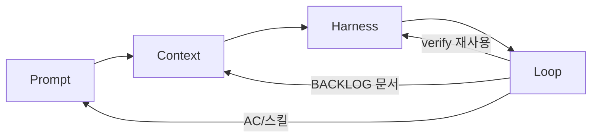

# 루프엔지니어링 설계

> **목적:** 이 모노레포에서 에이전트 작업을 **프롬프트 → 컨텍스트 → 하네스 → 루프** 네 층으로 나눠, 설계 의도·현재 상태·다음에 넣을 것을 한곳에 누적한다.  
> **스코프:** 우선 `@apps/user-portfolio`. 모노레포 전 앱 일괄 게이트는 하지 않는다.  
> **충돌 시:** 앱/아키텍처 규칙은 [`README.md`](README.md) · 에이전트 요약은 [`AGENTS.md`](AGENTS.md).  
> **관련:** [`docs/harness/README.md`](docs/harness/README.md) (하네스 게이트) · [`#32 루프엔지니어링 내용 정리.md`](#32%20루프엔지니어링%20내용%20정리.md) (루프 갭·로드맵) · [`#31작업중인 내용 정리.md`](#31작업중인%20내용%20정리.md) (FSD/보안 트랙)

**이 파일은 living doc이다.** 층별로 추가·변경되면 해당 절과 아래 현황 표를 함께 고친다.

---

## 한 줄 정의

| 층 | 한 줄 |
|----|--------|
| **프롬프트 엔지니어링** | 에이전트에게 보내는 문장·지시 형식을 잘 쓰는 기술 |
| **컨텍스트 엔지니어링** | 에이전트가 참고할 정보(문서, 코드, 규칙)를 잘 골라 주는 기술 |
| **하네스 엔지니어링** | 에이전트가 일할 환경(도구, 권한, 실행·검증 조건)을 잘 갖추는 기술 |
| **루프 엔지니어링** | 위 층이 사람 없이 반복되도록 **주기·종료조건·메모리·안전레일**을 설계하는 기술 |

```text
사람/스케줄러
    │
    ▼
[프롬프트] 목표·제약을 짧게
    │
    ▼
[컨텍스트] AGENTS / README / 스킬 / 관련 코드
    │
    ▼
[하네스] 도구 + verify/guard + denylist + CI
    │
    ▼
[루프] BACKLOG → Build/Report → verify → (사람 merge)  ← 아직 미구축
```

**현재 포지션:** 컨텍스트·하네스는 실사용 가능 수준. 루프(자율 반복·메모리)는 설계·갭 문서만 있다.

---

## 현황 요약 (업데이트 시 여기부터)

| 층 | 성숙도 | 상태 (한 줄) |
|----|--------|----------------|
| 프롬프트 | 관행 | 채팅·스킬·이슈 AC로 분산. 전용 템플릿 문서는 아직 얇음 |
| 컨텍스트 | 강함 | `AGENTS.md` / README / FSD / ai-skills / `.cursor/skills` |
| 하네스 | H1~H6 | `verify:portfolio` + Jest + e2e smoke + guard + PR CI |
| 루프 | L0~L1 일부만 하네스에 흡수 | BACKLOG/STATE/독립 verifier/budget **없음** |

마지막 갱신: 2026-09 (H3~H6 하네스 도입 직후)

---

## 1. 프롬프트 엔지니어링

### 1.1 의도

에이전트에게 **무엇을 할지 / 무엇을 하지 말지 / 무엇으로 끝났다고 할지**를 짧게·체크 가능하게 전달한다.  
프롬프트만으로 품질을 끌어올리기보다, 아래 컨텍스트·하네스가 받쳐 주도록 한다.

### 1.2 현재 이 프로젝트에서의 형태

| 자산 | 역할 |
|------|------|
| 이슈·채팅 지시 | 작업 단위 목표 (사람이 작성) |
| [`.cursor/skills/plan-change`](.cursor/skills/plan-change/SKILL.md) | AC에 테스트·e2e·`verify:portfolio` 한 줄을 넣도록 유도 |
| [`.cursor/skills/verify`](.cursor/skills/verify/SKILL.md) | “끝나면 verify 돌려라” 절차 프롬프트 |
| [`.cursor/skills/safe-edit`](.cursor/skills/safe-edit/SKILL.md) | denylist·시크릿 건드리지 말라는 제약 프롬프트 |
| 커밋/브랜치 규칙 ([`AGENTS.md`](AGENTS.md)) | 형식 제약 — 훅이 강제 |

### 1.3 잘된 점

- “검증 통과”를 말보다 **명령**으로 말하게 스킬화함
- human gate(보안 경로)를 프롬프트 스킬로 명시

### 1.4 부족 / 다음에 넣을 것

- [ ] 작업 유형별 프롬프트 템플릿 (feat / refactor / docs / hotfix) 짧은 예시 모음
- [ ] 루프 Build용 “한 백로그 = 한 프롬프트” 계약 문장 (L2와 연동)
- [ ] 한국어 응답·커밋 컨벤션을 매 프롬프트에 반복하지 않도록 AGENTS 의존을 전제로 한 **최소 지시 예시**

---

## 2. 컨텍스트 엔지니어링

### 2.1 의도

에이전트가 매 턴 추측하지 않도록, **읽을 문서·레이어 경계·명령**을 레포 안에 고정한다.  
Cursor / Claude Code가 파일을 잘 집어 오더라도, **무엇을 소스 오브 트루스로 둘지**는 프로젝트가 정한다.

### 2.2 현재 구조

| 우선순위 | 경로 | 내용 |
|----------|------|------|
| 1 | [`README.md`](README.md) | FSD·폴더명·REST·i18n 등 상세 SoT |
| 2 | [`AGENTS.md`](AGENTS.md) | 에이전트용 요약 + Commands + harness 포인터 |
| 3 | [`docs/harness/`](docs/harness/) | verify / denylist / H1~H6 |
| 4 | [`.cursor/skills/`](.cursor/skills/) | verify · plan-change · safe-edit |
| 5 | `node_modules/@shin96bc/ai-skills/...` | 웹 디자인 / CBD·FSD 퍼블 / Jest 등 작업 스킬 |
| 6 | [`#31`](#31작업중인%20내용%20정리.md) · [`#32`](#32%20루프엔지니어링%20내용%20정리.md) | 트랙별 인수인계·갭 |
| 7 | [`SECURITY-NOTES.tmp.md`](SECURITY-NOTES.tmp.md) | 보안 논점 (코드 반영은 #31) |

코드 컨텍스트(자동):

- FSD 레이어: `apps/*/src/fsd/{app,pages,widgets,features,entities,shared}`
- 도메인 패턴: `entities/*/api` + `model` + mapper (wire→client)
- Mock: MSW handlers (`shared/config/mock`)

### 2.3 잘된 점

- README ↔ AGENTS 이중 구조로 **요약 vs 상세** 분리
- Biome / `lint:fsd`가 “문서만의 규칙”이 아니라 **기계가 읽는 컨텍스트**로도 동작
- 하네스·루프 문서를 분리해 컨텍스트 과부하를 줄임

### 2.4 부족 / 다음에 넣을 것

- [ ] 루프 도입 시 `docs/loop/` (또는 루트 `BACKLOG`/`STATE`/`LOOP`)와 이 문서의 역할 표 고정
- [ ] SECURITY-NOTES → `docs/` 정식화 후 AGENTS에서 링크
- [ ] 타 앱(commerce 등)으로 스코프 확장 시 앱별 AGENTS 절 또는 필터 표

---

## 3. 하네스 엔지니어링

### 3.1 의도

에이전트(와 사람)가 **같은 합격 신호**로 “됐다/안 됐다”를 말하게 한다.  
도구·훅·CI·가드·스킬이 그 환경이다.

상세 운영: [`docs/harness/README.md`](docs/harness/README.md)

### 3.2 성숙도 H1~H6

| 단계 | 내용 | 상태 |
|------|------|------|
| H1 | lint / format / typecheck / husky(브랜치·lint-staged·pre-push) | ✅ |
| H2 | Biome FSD · `pnpm lint:fsd` · `AGENTS.md` | ✅ |
| H3 | `pnpm verify:portfolio` · Jest mapper 씨앗 · PR CI | ✅ |
| H4 | Playwright smoke (locale/viewport/timezone 고정, MSW) | ✅ |
| H5 | denylist + `pnpm guard:harness` (secret allowlist) | ✅ |
| H6 | `.cursor/skills` + AGENTS 진입점 | ✅ |

### 3.3 단일 게이트

```bash
pnpm verify:portfolio
# typecheck → biome(+fsd) → unit → guard:harness → e2e → build
```

| 조각 | 위치 |
|------|------|
| 스크립트 | 루트 `package.json` `verify:portfolio` / `guard:harness` |
| 단위 테스트 | `apps/user/portfolio/**/*.test.ts` (mapper) |
| e2e | `apps/user/portfolio/e2e/` · `playwright.config.ts` |
| 가드 | [`scripts/guard-harness.mjs`](scripts/guard-harness.mjs) |
| denylist | [`docs/harness/DENYLIST.md`](docs/harness/DENYLIST.md) |
| PR CI | [`.github/workflows/verify-portfolio.yml`](.github/workflows/verify-portfolio.yml) |
| Deploy quality | [`deploy-portfolio.yml`](.github/workflows/deploy-portfolio.yml) → 동일 `verify:portfolio` |
| env 예시 | [`apps/user/portfolio/.env.example`](apps/user/portfolio/.env.example) |

### 3.4 잘된 점

- 로컬·PR·deploy quality가 **한 명령**으로 수렴
- UI 앱에 맞게 smoke e2e + MSW
- 보안 민감 경로는 **수정 금지(가드)** 와 **코드 리라이트(#31)** 를 분리

### 3.5 부족 / 다음에 넣을 것

- [ ] `snap` / 비전 UI 검증 (루프 L3와 공유)
- [ ] denylist diff **strict** 모드를 PR에서 기본화할지 합의
- [ ] Jest 커버리지 확대 (mapper 외 utils)
- [ ] 타 앱 `verify:<app>` 패턴 복제
- [ ] #31 SECURITY 코드 반영 후 allowlist 축소

### 3.6 로컬 팁

- Windows e2e 브라우저 다운로드 이슈: `$env:PW_CHANNEL='chrome'`
- Google Fonts TLS: portfolio `next.config` `turbopackUseSystemTlsCerts`

---

## 4. 루프 엔지니어링

### 4.1 의도

사람이 매번 “확인해 / 고쳐 / 다시”를 치지 않아도, 에이전트가 **체크 가능한 목표**까지 verify·수정을 반복하고, 위험하면 멈추게 한다.  
하네스의 `verify`를 **종료 조건**으로 쓰고, 메모리·예산·독립 verifier·worktree를 얹는다.

갭·우선순위 상세: [`#32 루프엔지니어링 내용 정리.md`](#32%20루프엔지니어링%20내용%20정리.md)

### 4.2 목표 흐름 (미도입)

```text
사람: BACKLOG에 AC 작성
        │
        ▼
Report: PR/CI/백로그 관측 → STATE 갱신 (코드 변경 금지)
        │
        ▼
Build: lock → worktree → 구현 → verify → 독립 verifier → PR (auto-merge 금지)
        │
        ▼
사람: 머지 → BACKLOG-DONE → 재충전

Emergency: STATE.md 에 loop: paused
```

### 4.3 현재 상태

| 레일 | 상태 |
|------|------|
| 기계적 합격 신호 (`verify:portfolio`) | ✅ 하네스에서 제공 (루프가 재사용) |
| 단위/e2e 씨앗 | ✅ |
| denylist / secret 가드 | ✅ (루프 `LOOP.md` 승격 전 임시 SoT = harness) |
| `BACKLOG` / `STATE` / `LOOP` / run-log | ❌ |
| 독립 verifier (coding ≠ approve) | ❌ |
| budget / concurrency lock / kill switch | ❌ |
| worktree 루프 절차 | ❌ |
| Plan/Build/Report **루프** 스킬 | ❌ (하네스 스킬만 있음) |
| snap UI vision | ❌ |

### 4.4 권장 착수 순서 (루프)

1. L2: `BACKLOG` / `STATE` / `LOOP` + Report-only + `loop: paused`
2. L3: snap (선택) · e2e 확장
3. L4: 독립 verifier · budget · worktree · human merge only
4. L5: Plan/Build/Report 루프 스킬 · 주기 Report

### 4.5 하지 말 것

- AC 없는 Build 루프
- verifier 없이 coding 에이전트 자기 APPROVE
- denylist·paused 없이 무제한 토큰 루프
- 사용자 요청 없이 commit / push / force push
- 모노레포 전 앱을 첫날부터 한 루프에 묶기

---

## 5. 레이어 간 의존



- **루프는 하네스 없이 성립하지 않음** → 이미 H3~H6까지 깔아 둔 이유.
- **컨텍스트가 약하면** 루프가 잘못된 파일을 고친다 → AGENTS/FSD 유지가 루프 품질의 전제.
- **프롬프트**는 루프 시대에도 “백로그 한 줄”로 남는다. 길어질수록 컨텍스트·하네스로 내린다.

---

## 6. 파일 맵 (이 설계의 앵커)

```text
루프엔지니어링 설계.md          ← 이 파일 (4층 living SoT)
AGENTS.md                       ← 에이전트 요약 + verify 명령
README.md                       ← 아키텍처 SoT
docs/harness/README.md          ← 하네스 운영
docs/harness/DENYLIST.md        ← human gate 경로
scripts/guard-harness.mjs
.cursor/skills/{verify,plan-change,safe-edit}/
.github/workflows/verify-portfolio.yml
apps/user/portfolio/e2e/
#32 루프엔지니어링 내용 정리.md ← 루프 갭·L0~L5 체크리스트
#31작업중인 내용 정리.md        ← FSD/보안 구현 트랙
SECURITY-NOTES.tmp.md           ← 보안 논점 (임시)
```

---

## 7. 변경 로그

| 날짜 | 요약 |
|------|------|
| 2026-09 | 초안. 4층 정의 + 현 상태(하네스 H1~H6, 루프 미구축) 정리 |
